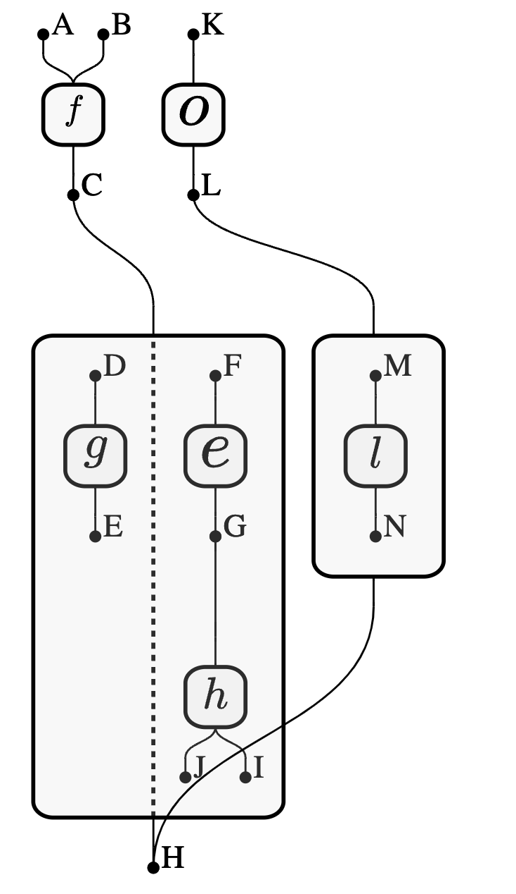

# E-Hypergraphs visualisation

This projects aims to help with visualising e-hypergraphs by using `d3`. Examples could be found [here](/src/example.ts). A typical example is



> ✨ Bootstrapped with Create Snowpack App (CSA).

## Available Scripts

```bash
npm start
```

Runs the app in the development mode.
Open http://localhost:8080 to view it in the browser.

The page will reload if you make edits.
You will also see any lint errors in the console.

```bash
npm run build
```

Builds a static copy of your site to the `build/` folder.
Your app is ready to be deployed!